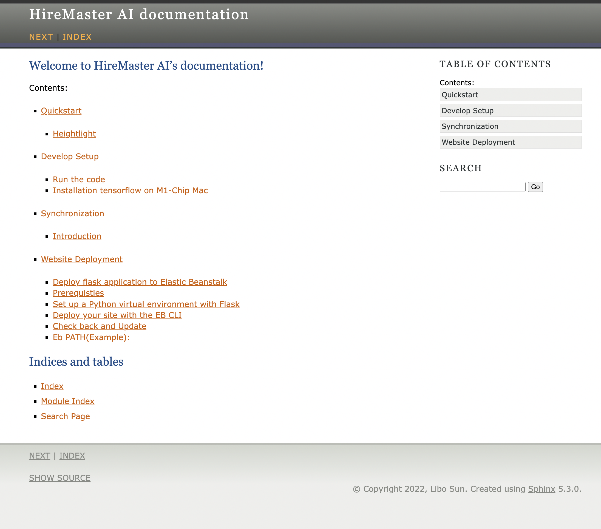

Synchronization
===============

Introduction
------------

Synchronization is the key role for dataflow between the front-end and AI back-end.
Through synchronization, the AI back-end can hold the same data as the front-end.

* A thing.
* Another thing.

or

1. Item 1.
2. Item 2.
3. Item 3.

or

- Some.
- Thing.
- Different.
  

This is a normal text paragraph. The next paragraph is a code sample::

   It is not processed in any way, except
   that the indentation is removed.

   It can span multiple lines.

This is a normal text paragraph again.

This is a paragraph that contains `a link`_.

.. _a link: https://domain.invalid/

*emphasis*

**strong**

``literal``

.. function:: foo(x)
              foo(y, z)
   :module: ai.solution

   Return a line of text input from the user.

Lorem ipsum [Ref]_ dolor sit amet.

.. [Ref] Book or article reference, URL or whatever.

To use Lumache, first install it using pip:

.. code-block:: console

   (.venv) $ pip install lumache

.. This is a comment.

..
   This whole indented block
   is a comment.

   Still in the comment.

.. math::
   fitness = \frac{impression + 10 \times click + 100 \times conversion}{\sqrt{costs \times cpc}}
